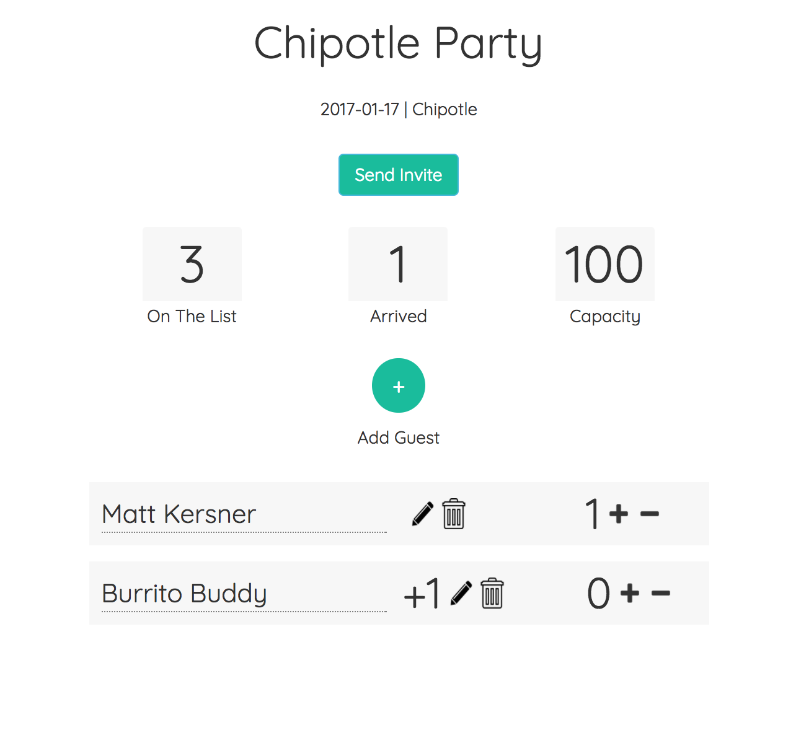

# Put Me On The List

[Link: ] (https://ns-cjuebetxql.now.sh/)

Welcome to Put Me On The List, the easiest way to invite and track your party's guests.  The app idea sprung from past work experiences of managing RSVP lists and Google Docs and manually taking in email responses not cutting it.

##Tech used
-HTML
-CSS
-ReactJS
-Axios
-React-Bootstrap
-Firebase

##Approach

There were many big picutre ideas that had to be considered before beginning the project.  Setting up a back-end structure was a new problem to tackle, and I knew it would be an important one in this case.  There are four separate pages to the app, and they all must communicate with each other, and ONLY pass data to and from the pages with the same associated events.  

First task was getting the main admin page set-up, so that a user can manage everything about their event from that page.  This included, adding new attendees to the event, as well as editing and deleting those attendees.  Once that was set up, there are a few other important features I thought this app should have, most notably tracking the number of positive RSVPs (put me on the list!) and then tracking how many of those people actually attend once the event has started.

This app has the ability not only to invite and check the positive RSVP list, but also to manage the number of attendees versus a set event capacity.

Then came setting the user flow of a person creating an event, from the homepage all the way through.  From the HP, there is an event set up page that is very important.  This is when the event is passed to the server, and the unique key for that event is set up, which allows only that event to pass data between each other.  

This allows for a key function, the ability to send a link to a friend, and have them add themselves to the guest list.

Cool app, but certainly needs some Auth to see real world application.

##Improvements to be made

 - Search box for searching through large swaths of party goers
 - Edit event functionality from admin page
 - Design tweaks 
 - Authentication
 - form validation
 - Conditional formatting on event goers

##Lessons Learned
I'm excited that I was able to tackle some new concepts and reinforce some old ones.  React router was a new problem, and while not complex on it's own, it presented new problems in how to tie unique server keys to URL strings, and have these pages only talk to one another.  That was a problem I was proud to solve.  This was also the first time I've worked with React-Bootstrap, a componentized version of Bootstrap that was very useful for generating forms and buttons with a templatized style.  Working with Firebase on a slightly more complex app structure was also a big learning point.  
